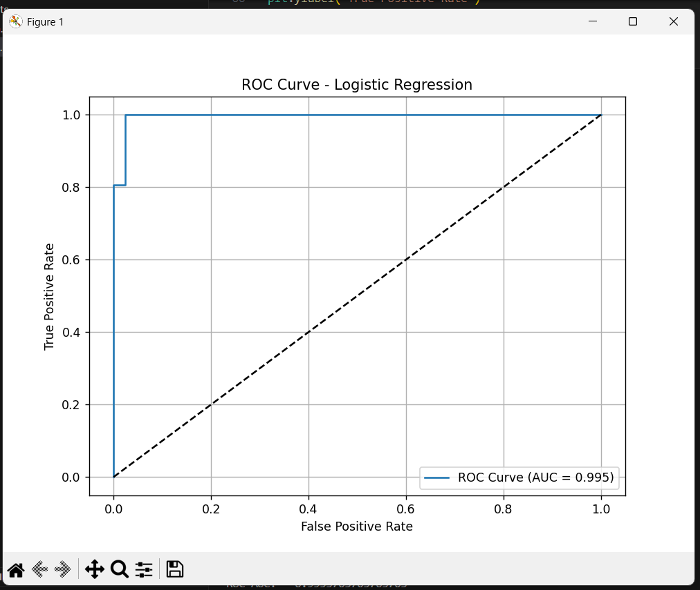
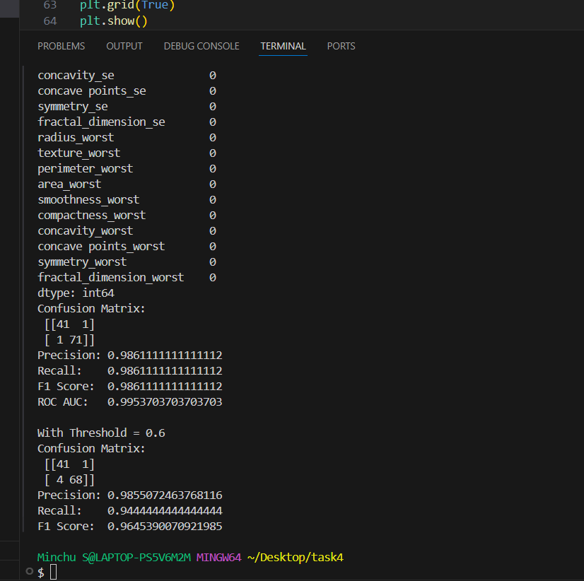

# Binary_classifier
# 🎯 Breast Cancer Classification using Logistic Regression (Task 4)
This is a project, where I built a machine learning model to classify breast tumors as **benign** (non-cancerous) or **malignant** (cancerous) using **Logistic Regression**.
## 📌 Objective of the Task
> **Build a binary classification model using logistic regression** and evaluate it using proper ML metrics.

## 🧠 What Is Binary Classification?
Binary classification is when the model predicts between **two possible outcomes**.  
In this case:
- `0` → Malignant tumor (cancer)
- `1` → Benign tumor (non-cancer)

## 📊 Dataset Used
- **Name:** Breast Cancer Wisconsin (Diagnostic) Dataset
- **Format:** CSV (`data.csv`)
- **Target column:** `diagnosis`
  - `M` = Malignant → mapped to `0`
  - `B` = Benign → mapped to `1`
- **Input features:** 30 columns like radius, texture, smoothness, symmetry etc.
### 🔹 Step 1: Load the Dataset
- I used `pandas` to load `data.csv`.
- Removed unnecessary columns like `id` and any unnamed columns.
- Converted `diagnosis` from text labels (`M`/`B`) to numbers (`0`/`1`).

### 🔹 Step 2: Check and Clean the Data
- Checked for any **missing values (NaN)** or **infinite values** that may cause errors.
- Replaced missing values with 0.

### 🔹 Step 3: Split the Data
- Used `train_test_split()` to divide data into:
  - **Training set (80%)** – used to train the model
  - **Test set (20%)** – used to check how good the model is

### 🔹 Step 4: Feature Scaling
- Used `StandardScaler()` to normalize the features.
- Scaling helps logistic regression work better by putting all features on the same scale.

### 🔹 Step 5: Train the Logistic Regression Model
- Used `LogisticRegression()` with a higher max iteration limit (to avoid convergence warnings).
- Trained the model using training data.

### 🔹 Step 6: Predict and Evaluate
- Used `.predict_proba()` to get prediction probabilities.
- Used `.predict()` to get final class labels (0 or 1).
- Evaluated model using:
  - Confusion Matrix: Shows true/false positives/negatives
  - Precision:Of all predicted positive cases, how many were actually positive
  - Recall:Of all actual positive cases, how many did the model catch
  - F1 Score:Balance between precision and recall
  - ROC AUC Score:Graph of True Positive Rate vs False Positive Rate ,Area under ROC curve; closer to 1 means better model 

## 📉 ROC Curve

> The ROC Curve shows the model's ability to distinguish between malignant and benign tumors at various thresholds.
### ✅ AUC = 0.995 → Nearly perfect separation between classes.

- **X-axis:** False Positive Rate
- **Y-axis:** True Positive Rate
- The curve close to the top-left corner = better model.
## 📊 Model Results (Threshold = 0.5) and threshold:0.6
    
    

